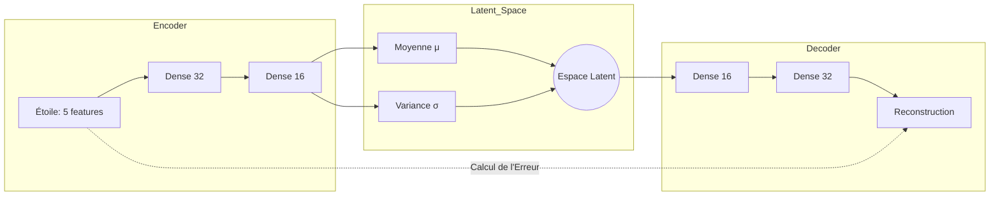

#  Gaia Anomaly Detection (VAE)

Ce module implémente un **Autoencodeur Variationnel (VAE)** pour identifier des objets célestes atypiques ou rares dans le catalogue Gaia DR3 en apprenant la "normalité" statistique des populations stellaires.

##  Architecture VAE

Le flux de données compresse les caractéristiques stellaires dans un espace latent avant de tenter une reconstruction parfaite.

# Méthodologie
Apprentissage : Le modèle minimise la perte de reconstruction et la divergence KL (régularisation de l'espace latent).

Scoring : Chaque étoile reçoit un "score de surprise" basé sur l'erreur de reconstruction (MSE).

Détection : Les objets dépassant le 99e percentile sont marqués comme anomalies.

# Applications
Identification d'étoiles à grande vitesse.

Détection d'erreurs de mesure ou d'objets astrophysiques exotiques.

Cartographie photométrique des populations atypiques.
